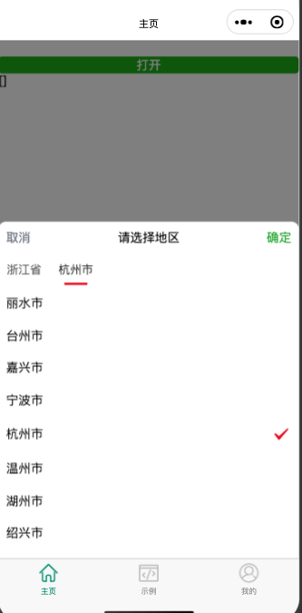
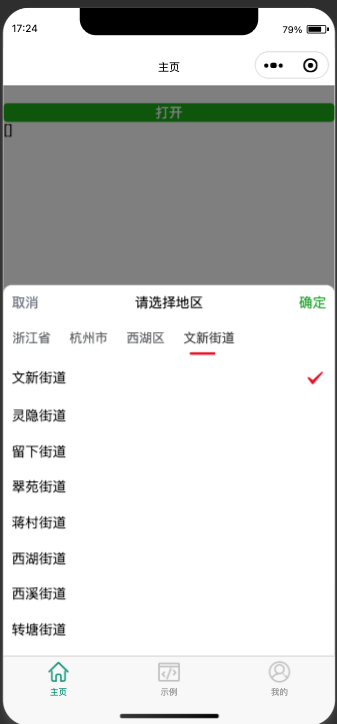

## 地区选择组件

🚀 基于 `uv-ui` 封装的地区选择组件，支持数据双向绑定。

### 基本使用

- 通过 `ref` 调用 `open()` 控制组件的打开。
- 都通过传入数组 `options` 配置选择项。

```vue
<template>
  <view class="h-full overflow-auto">
    <view>
      <AddressSelect
        ref="AddressSelectRef"
        v-model="selectVal"
        :options="options"
        :start-level="2"
        @change="change"
        @confirm="confirm"
        @cancel="cancel"
        @close="close"
      >
      </AddressSelect>

      <div class="mt-20px"></div>
      <uv-button type="primary" block @click="open">
        打开
      </uv-button>
      {{ selectVal }}
    </view>
  </view>
</template>

<script setup lang="ts">
import { AddressJson } from './helper'
import AddressSelect from '@/components/AddressPicker/index.vue'
import type { OptionsItem } from '@/components/AddressPicker/AddressPicker'

const AddressSelectRef = ref()
const selectVal = ref([])
const options = ref<OptionsItem[]>([])
setTimeout(() => {
  // selectVal.value = ["330000", "331000"];
}, 1000)
setTimeout(() => {
  options.value = AddressJson as any
  console.log(options.value)
}, 2000)

function open() {
  AddressSelectRef.value.open()
}
function change(data) {
  console.log(data, 'change')
}
function confirm(data) {
  console.log(data, 'confirm')
}
function cancel() {
  console.log('点击了取消按钮')
}
function close() {
  console.log('关闭了')
}
</script>
```

### API

#### Props

<!-- 列表数据 -->
<!-- 默认值 -->

| 参数                | 说明                                                                              | 类型                                                                                    | 默认值                                                |
| ------------------- | --------------------------------------------------------------------------------- | --------------------------------------------------------------------------------------- | ----------------------------------------------------- |
| modelValue(v-model) | 选中项的值                                                                        | array                                                                                   | `[]`                                                  |
| title               | 顶部标题                                                                          | string                                                                                  | `请选择地区`                                          |
| placeholder         | 未选中时的提示文案                                                                | string                                                                                  | `请选择`                                              |
| options             | 可选项数据源                                                                      | string[] [示例](#options-示例)                                                          | `[]`                                                  |
| column              | 需要显示层级(设置后优先根据设置值显示需要展示的列数，例如 : [示例](#column-示例)) | number                                                                                  | `-1`                                                  |
| startLevel          | 数据中 level 开始等级(主要为了解决 `tabs` 索引与 数据中 `level` 关联问题)         | number                                                                                  | `0`                                                   |
| maskClosable        | 点击蒙层是否允许关闭                                                              | boolean                                                                                 | `true`                                                |
| fieldNames          | 自定义 options 结构中的字段                                                       | object                                                                                  | `{label: "label",value: "id", children: "children",}` |
| tabsConfig          | tabs 配置                                                                         | Object (参考：[uv-ui-tabs-props](https://www.uvui.cn/components/tabs.html#tabs-props) ) | `{lineColor: "#ec0e23",}`                             |
| showIcon            | 取消确定是否使用 `Icon`                                                           | boolean                                                                                 | `false`                                               |

#### options 示例

```js
const options = [
  {
    id: '330000',
    label: '浙江省',
    code: '330000',
    level: '2',
    parentId: '0',
    children: [
      {
        id: '330100',
        label: '杭州市',
        parentId: '330000',
        code: '330100',
        level: '3',
        children: [
          {
            id: '330102',
            label: '上城区',
            parentId: '330100',
            level: '4',
            code: '330102',
            children: [
              // ...
            ],
          },
        ],
      },
    ],
  },
]
```

##### column 示例

- :column="2"



- 不设置 column



#### Methods

| 事件名称        | 说明             | 回调参数 |
| --------------- | ---------------- | -------- |
| open            | 打开区域选择组件 | 无       |
| close           | 关闭区域选择组件 | 无       |
| getSelectRows   | 获取选中数据     | 无       |
| getSelectRowIds | 获取选中数据 Id  | 无       |

#### Events

| 事件名称 | 说明               | 回调参数                  |
| -------- | ------------------ | ------------------------- |
| @change  | 当选择值变化时触发 | [参数](#change-回调参数)  |
| @confirm | 点击确定按钮触发   | [参数](#confirm-回调参数) |
| @cancel  | 点击取消按钮触发   | -                         |
| @close   | 关闭选择器时触发   | -                         |

##### @confirm 回调参数

```js
{
    selectedIds: [], // 当前选择项 id 数据
    selectedRows: [], // 当前选择项 row 数据
}
```

##### @change 回调参数

```js
{
    selectedIds: [], // 当前选择项 id 数据
    selectedRows: [], // 当前选择项 row 数据
    value: {} // 当前点击项数据
}
```

#### Slots

| 名称    | 说明       | 回调参数  |
| ------- | ---------- | --------- |
| default | 选择项内容 | `options` |
| header  | 头部内容   | -         |

### Example

- 暂无
